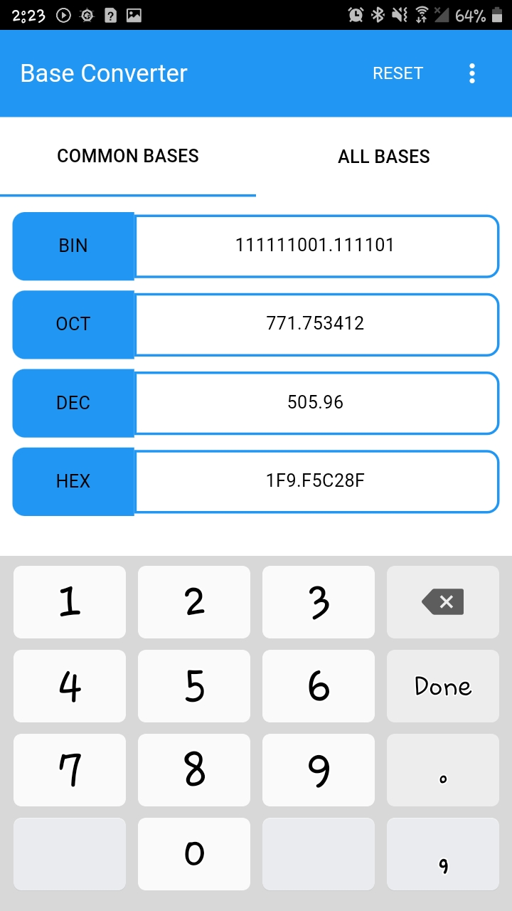
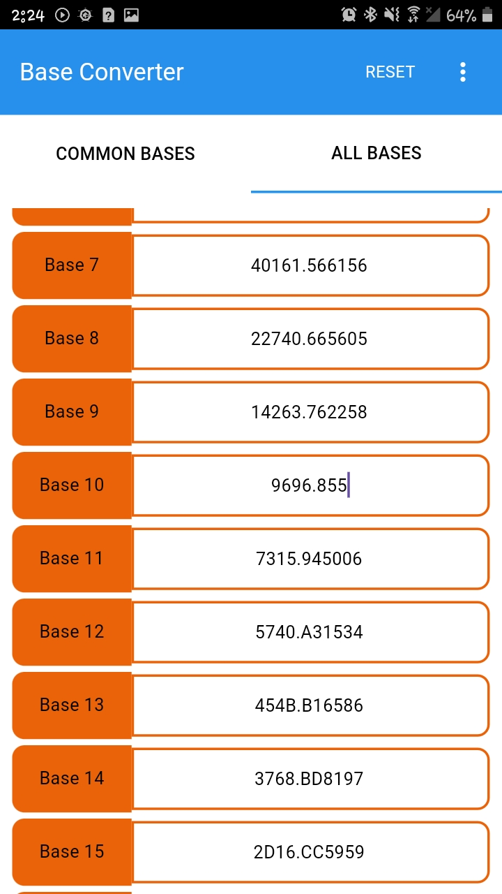
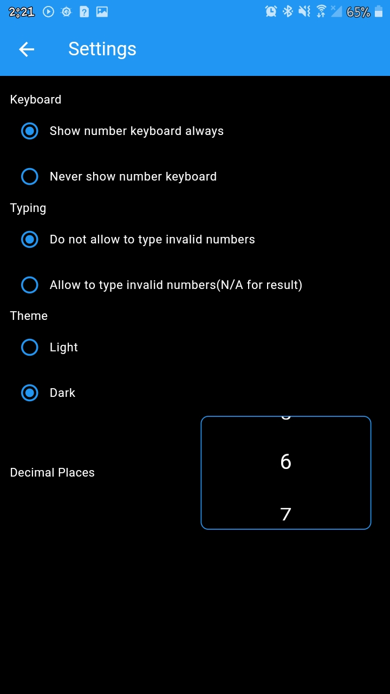
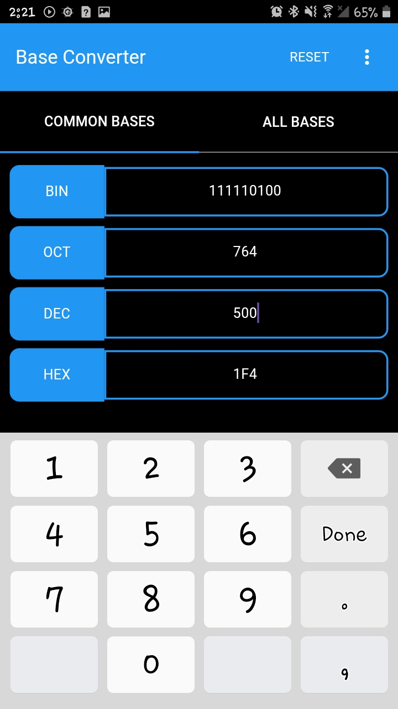

# base_converter_app

## About the App
This is a clone of the app built by [Universapp](https://play.google.com/store/apps/developer?id=Universapp) using flutter.
### Functionality
- It can convert from any base to another(up till base 30)
- Light and Dark theme
- Decimal place base conversion
### Dependencies used
- Gap
- Shared preference
- url launcher

Basically for the state management, setstate and callbacks were used.

 1&nbsp;&nbsp;&nbsp;  

 1&nbsp;&nbsp;&nbsp;    

